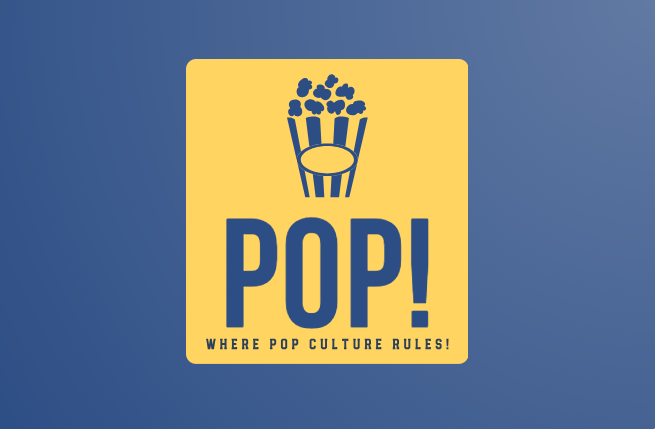

**_Pop!_** is a web application built with [Next.js](https://nextjs.org/), using [React](https://reactjs.org/) for the front-end and [Firebase](https://firebase.google.com) for the back-end. The application is hosted on [Vercel](https://vercel.com/).

It allows authenticated users to create, organize, play and/or spectate quizz games with friends, that revolve around **_pop culture_** in general, whether it be _video games_, _movies_, _animes/mangas_, _music_, _literature_, _Internet_, etc.

## 🔓 Authentication

The app uses [NextAuth.js](https://next-auth.js.org/) to authenticate users. The authentication session tokens, accounts and users information is stored in a [Firestore Database](https://firebase.google.com/docs/firestore). The authentication proposes the following **OAuth2** providers: [Google](https://next-auth.js.org/providers/google) and [Discord](https://next-auth.js.org/providers/discord)

## ℹ️ Structure of a Game

Each game is structured in multiple **rounds**, each consisting of various **questions** of specific types. Teams accumulate points within each round, determining their positions on a point scale. By default, the latter is set to:

- 🥇 **3 points** for the leading team
- 🥈 **2 points** for the second-ranking team
- 🥉 **1 point** for the third-ranking team

The definition of the "best" team varies based on the round type. In most cases, it is the team with the highest point accumulation. However, in **Odd One Out** and **Matchings** rounds, the best team is the one that made the least mistakes.

### Game Roles

In each game, an authenticated user can have either of three roles: `organizer`, `player` or `spectator`.

#### Organizer (`organizer`)

The **organizers** are the users who created the game. They can edit the game's rounds, questions, settings. During an active game, they control the game states, validate or invalidate a player's answer.

#### Player (`player`)

The **players** are the users who joined the game. There are given specific controls to answer the questions, at the bottom of the screen.

Players can either play alone or in teams. To simplify the code, a solo player is considered as a team of one player.

#### Spectator (`spectator`)

The **spectators** are the users who joined the game in an observer role. They can see the game's state and the players' scores, but they are not given any controls.

### 💯 Scoring System

There are two scoring systems for each team, displayed at the top of the screen:

- **Round scores**, gained within each round, and displayed while the round is ongoing.
- **Global scores**, accumulated across the entire game as rounds progress, and displayed in all other cases.

## Types of Rounds

**_Pop!_** features 9 types of questions, each with unique rules and gameplay. In addition, a special round is available at the end of the game, as a final step to determine the winner.

> [!WARNING]
> The game is designed to be played while chatting in-person or on a VoIP application such as Discord or Zoom.

The game's homepage (`game_home`) displays the available rounds. After each round, the team with the lowest points (or a randomly selected one if there are multiple lowest-scoring teams) chooses the next round. The initial **"chooser"** team is randomly selected at the start of the game.

/_TODO: add a demo of the game home_/

Let us now describe each type of round.

### 💡 Progressive Clues (`progressive_clues`)

The goal of each question is to find the video game, film, book, character, artist etc. that hides behind the **list of clues**. The clues are added progressively by the organizer. Each clue reveals an additional information about the element to guess.

Once a player thinks they know the answer, they press a buzzer button. If they buzzed the fastest among the other players, the focus is put on them and they can provide an oral answer. The organizer can then either:

- **validate** the answer, which ends the question and rewards the player with 1 point.
- **invalidate** the answer, which prevents the player from answering again before a number of clues defined by the organizer (e.g., 2), ands puts focus on the second player in the buzzer list, if any.

#### Quick demo (Player POV)

https://github.com/jmettler27/Pop/assets/56764091/3980b830-a91d-48b6-9270-76cf7c1575fd

#### Full round (Spectator POV)

An example round is visible [on YouTube](https://youtu.be/JscPXeTtSIM?si=efyjvQvTZJ35Elm3&t=60) (in French).

### 🖼️ Image (`image`)

In each question, an **image** is displayed. The goal is to find an artwork but also the element that is described by this image, like a **location**, a **character**, an **object**, etc.

Again, each player is given a buzzer button and must give an oral answer.

#### Quick demo (Player POV)

https://github.com/jmettler27/Pop/assets/56764091/e659cc98-c3ca-4da2-b865-86470aa2f4db

#### Full round (Spectator POV)

An example round is visible [on YouTube](https://youtu.be/JscPXeTtSIM?si=VAClN1C5dXHKo2Ho&t=3538) (in French).

### 😃 Emoji (`emoji`)

In each question, a **combination of emojis** is displayed. The goal is to find the artwork, artist, etc. that hides behind the combination of emojs.

This combination can evoke, for instance:

- The important ideas/concepts/scenes of a film, book, video game, etc.
- The most famous works of an actor, director, etc.
- or it can just be a rebus

Again, each player is given a buzzer button and must give an oral answer.

#### Quick demo (Player POV)

https://github.com/jmettler27/Pop/assets/56764091/12cb7249-ff81-4d70-a47d-ffb0a370d71a

#### Full round (Spectator POV)

An example round is visible [on YouTube](https://youtu.be/JscPXeTtSIM?si=fQm91tnLl5z8PU__&t=1753) (in French).

### 🎧 Blindtest (`blindtest`)

In each question, an **audio player** is displayed with controls to pause, resume, seek and change the volume of the audio.

The goal is to find the artwork in which this audio appears, and optionally the artist, the title, or the moment in which it appears.

The audio can evoke either:

- a **song** taken from the soundtrack, e.g., main theme, opening of an anime
- or a **sound** that appears in it, e.g., a famous line, a sound effect.

Again, each player is given a buzzer button and must give an oral answer.

/_TODO: add a demo of the blindtest_

An example round is shown [on YouTube](https://youtu.be/JscPXeTtSIM?si=ehytl5m_jZaN36tx&t=3079) (in French).

### 💬 Quote (`quote`)

In each question, a **quote** taken from an artwork is displayed, but with some aspects of it hidden. The goal is to reconstruct the quote by filling the missing parts. These can be a combination of:

- the **author** of the quote
- the **source** artwork in which the quote appears
- **parts of the quote** itself

Which aspect(s) of the quote is/are hidden is decided by the user who created the question beforehand.

Again, each player is given a buzzer button and must give an oral answer.
The trick in this type of questions is that the players must be able to reconstruct the quote as fast as possible, because the more parts of the quote are revealed, the less points the team will earn.

### 🗣️ Enumeration (`enum`)

Each question prompts players to list as many relevant elements as they can in response to the query (e.g., "Name as many Springfield residents as you can in _The Simpsons_").

The question proceeds through two phases, with the duration of each stage determined by the user who created the question:

- A **reflection** phase, during which players determine and submit their bets.
- A **challenge** phase, in which the team with the highest bet declares it answers orally. The organizer validates one-by-one the answers, which reveals them on the list of answers.

Two potential outcomes ensue:

- **The bet is made**, i.e. the player has stated the number of answers they declared and they are all correct: the team earns 1 point, with an additional bonus point if it provides more answers than initially announced.
- **The bet is not made**, i.e. the player has stated a number of answers that is lower than the number they declared: all other teams gain 1 point.

The trick in this type of questions lies in the fact that the teams must bet on the number of answers they _think_ they can give. The goal is to aim for a high bet without going too far, because if the team falls short of its bet, it forfeits the question. But simultaneously, to advance to the second phase, a team must have the highest bet, adding an element of strategic gameplay. This setup leads to intricate mind games among teams, as they attempt to predict others' bets or bluff about their own bet.

#### Quick demo (Player POV)

https://github.com/jmettler27/Pop/assets/56764091/846bdc4b-b77e-4b85-ba44-30a64c17824d

#### Full round (Spectator POV)

An example round is visible [on YouTube](https://youtu.be/JscPXeTtSIM?si=JzRGfiyKHl-5fF6O&t=2108) (in French).

### 🕵️ Odd One Out (`odd_one_out`)

This question format is inspired by the round titled **"Le coup par coup" (_Stroke by stroke_)** from the French game show **["Les Douze Coups de midi"](https://fr.wikipedia.org/wiki/Les_Douze_Coups_de_midi) (_The Twelve Strokes of Midday_)** presented by [Jean-Luc Reichmann](https://en.wikipedia.org/wiki/Jean-Luc_Reichmann).

Each question consists in **10 proposals**, **9 of which are correct** with respect to the question, and **1 that is incorrect** (the **"odd one out"**). The proposals are displayed in a random order for each user. Each team alternates and clicks on a proposal they think is correct. The goal is to end the question by clicking on all correct proposals and not click on the odd one out.

Even if a team has spotted the odd one out, it must keep it to itself and continue to click on the correct proposals. Otherwise, it must pray to not click on the odd one out and that the other team does not notice the odd one out.

The team that clicks on the odd one out "wins the question" and its score is incremented, but contrarily to other rounds (except matchings), the team scores in this round are sorted in the **ascending order of points earned**.

The team that selected the odd one out is at disadvantage for the next question, because it is put as the chooser team.

#### Quick demo (Player POV)

https://github.com/jmettler27/Pop/assets/56764091/7ea3da09-5544-4598-b994-85181b2c35b6

#### Full round (Spectator POV)

An example round is visible [on YouTube](https://youtu.be/JscPXeTtSIM?si=YB09-zl5ZlZbXeje&t=1170) (in French).

### 💖 Matching (`matching`)

Each question consists in **2 or 3 columns of proposals** between which there exists a **unique combination (the matchings)**. The goal is to find all the correct matchings between the columns.

Each team alternates and creates a matching they think is correct by clicking on the nodes of the link.

Similarly to odd one out questions, finding a correct answer does not reward the team, but making a mistake --- i.e., creating an incorrect or partially correct matching --- does. The team scores in this round are again sorted in the **ascending order of points earned**.

In all cases, the matching is displayed to all teams once it is created. The trick here is that even an incorrect or partially correct matching is displayed, which helps the other team(s) to not make the same mistake and reduce the set of possible matchings to find the correct ones.

In each column the proposals are displayed in a random order for each user, but the order of columns is kept unchanged.

#### Quick demo (Player POV, two columns)

https://github.com/jmettler27/Pop/assets/56764091/15ba1c19-8d2b-4e3d-8da0-f46dc817f810

#### Quick demo (Player POV, three columns)

https://github.com/jmettler27/Pop/assets/56764091/dc3d7709-f1b0-4191-bcb5-05aa20634159

### 💲 Multiple-Choice Question (MCQ) (`mcq`)

This question format is inspired by the game show \*\*["Who Wants to Be a Millionaire?"](<https://en.wikipedia.org/wiki/Who_Wants_to_Be_a_Millionaire%3F_(British_game_show)#Game_rules>).

For each question, the player is presented with **four choices**. The player must select the correct answer from the list of choices.

### 🐴 Nagui (`nagui`)

This question format is inspired by the French game show **["Tout le monde veut prendre sa place"](https://en.wikipedia.org/wiki/Tout_le_monde_veut_prendre_sa_place#Game_format) (_Everyone wants to take their place_)** presented by [Nagui](https://en.wikipedia.org/wiki/Nagui).

For each question, the player is presented with **three options**, ranging from the most challenging to the easiest:

- 🙈 **_Hide_**: Provide an immediate oral response to the question.
- 4️⃣ **_Square_**: Display 4 choices, and the player must select the correct answer.
- 2️⃣ **_Duo_**: Reduce the MCQ to 2 choices, and the player must select the correct answer.

Each option is assigned a different point value based on its difficulty; for example, 5 points for _Hide_, 3 points for _Square_ and 1 point for _Duo_.

#### Quick demo (Player POV, Duo)

https://github.com/jmettler27/Pop/assets/56764091/cdc0d1ed-1fed-498f-b033-7746592d9a19

#### Quick demo (Player POV, Square)

https://github.com/jmettler27/Pop/assets/56764091/235e7e2a-3cdc-418c-8926-34319ae9c195

#### Quick demo (Player POV, Hide)

https://github.com/jmettler27/Pop/assets/56764091/b5faffbb-1bdb-41cc-987b-c2b4237464e7

### 🏆 The Special Round (`special`)

This round becomes accessible once all preceding rounds have ended. In this round, various **themes** are proposed. Each team selects a theme and responds to a series of questions associated with it, categorized into 5 **sections**.

Providing a correct answer in this round does not yield any points. However, unlike the earlier rounds, providing an incorrect answer deducts 1 point from the team's accumulated global score from the previous rounds.

The team with the highest score at the end of this round emerges as the winner of the game.

#### Quick demo (Player POV)

### Initiating a Round (`round_start`)

Upon selecting a round, an introductory page outlines the round's principles, rules, question-specific rewards, and the concluding point scale.

#### Example (Player POV)

### Completing a Question (`question_end`)

At the end of each question, the answer of the question is displayed, along with the team(s) that provided the correct answer. The team(s) that provided the correct answer are rewarded with the number of points associated with the question type.

Moreover, a _Continue_ button appears for each player. Pressing it signals the player as `ready` for the next question. Once all players are ready, a 5-second countdown precedes the display of the next question.

/_TODO: add a demo of the question_end page_

### Completing a Round (`round_end`)

When the last question in the round completes, a summary showcases each team's score for the round, as well as the updated global scores based on the round's outcomes.

A line chart illustrates each team's score progression within the round, aiding users in visualizing the evolution of the team performance throughout the round. Similarly, another line chart displays the global score progression for each team throughout the game.

#### Example (Player POV)

### 🔊 Sound Effects

The game features a variety of **sound effects**, stored in the Firebase Storage, which are played in response to specific events, such as:

- A player providing a correct/incorrect answer
- A player buzzing in
- Starting/Completing a question
- Selecting/Completing a round

The organizers are provided a **soundboard** with small selection of sound effects to choose from, that they can play at any time.

All users can adjust the volume of the sound effects, or mute them entirely.

## Joining a game (`/join/[gameId]`)

When joining a game, a player can choose to either **play alone**, **create a new team** or **join an existing team**. If the game is full, the player will automatically become a spectator. The maximum number players allowed is decided by the organizer(s).

Moreover, the player can choose a nickname for the game, and a color for their team, if they play solo or create a new team.

## Creating and submitting questions (`/submit`)

An authenticated user can submit questions to the database, which will be reviewed by the app's administrators. Once approved, the question will be available to all users.

The submission process is handled by filling a form, that is different for each type of question.

### Example: submitting a blindtest question

https://github.com/jmettler27/Pop/assets/56764091/109c2322-c102-46ad-bc08-4a12e37ae8b0

## ✍️ Creating and editing games (`/edit` and `/edit/[gameId]`)

An authenticated user can create a game (`/edit`), which gives them access to an editing dashboard (`/edit/[gameId]`) and automatically assigns them as organizer of this game. From there, they can add or remove rounds, then add or remove questions to a round, either by selecting one from the database or by creating a new question on-the-fly.

When the organizer(s) think the game is ready, they can launch it, which makes it visible to all users on the site's home page.

_TODO: add a demo of the game creation and editing process_

## The origins of the project

The concept originated from a practical need. My friends and I consistently enjoyed creating and playing in quiz games together, which we dubbed **_Quiz Pop Culture (QPC)_**, centered around our shared interests in video games, films, TV shows and anime.

Initally, we conducted these quizzes verbally on Discord, but it proved to be impractical.

We then transitioned to using PowerPoint presentations, which enhanced the experience by introducing a visual element. An illustrative game was recorded and is available [here](https://youtu.be/B2OT0Y5K6PE?si=HN0XiR-_CH-6DLO7) (video in French).

However, the organizers would have to manually keep track of the scores, which was tedious and error-prone. Moreover, the lack of a visual element made it difficult to follow the game's progression. Most importantly, this format **lacked player interaction**.

This prompted me to develop a web app that would facilitate real-time quiz games, offering **complete interactivity** and addressing the issues we encountered with previous methods. My motivation was further fueled by our enjoyment of the interactive quiz game [PopSauce](https://jklm.fun/), which we occasionally played.

All question types in **_Pop!_** are in fact implementations of the question types we used in our original quiz games. Likewise, most of the database's questions are directly sourced from our past quiz game sessions.

## 🧰 Technologies

- UI: [React.js](https://reactjs.org/)
  - Styling:
    - [Material UI](https://material-ui.com/)
    - [Tailwind CSS](https://tailwindcss.com/)
  - Forms:
    - [Formik](https://formik.org/)
    - [Yup](https://github.com/jquense/yup) for object schema validation
- Authentication: [NextAuth.js](https://next-auth.js.org/)
- Backend: [Firebase v9](https://firebase.google.com/)
  - Database: [Firestore Database](https://firebase.google.com/docs/firestore)
  - Storage: [Firebase Storage](https://firebase.google.com/docs/storage)
  - [react-firebase-hooks v4](https://github.com/CSFrequency/react-firebase-hooks/tree/v4.0.2)
  - Hosting: [Vercel](https://nextjs.org/docs/pages/building-your-application/deploying)
